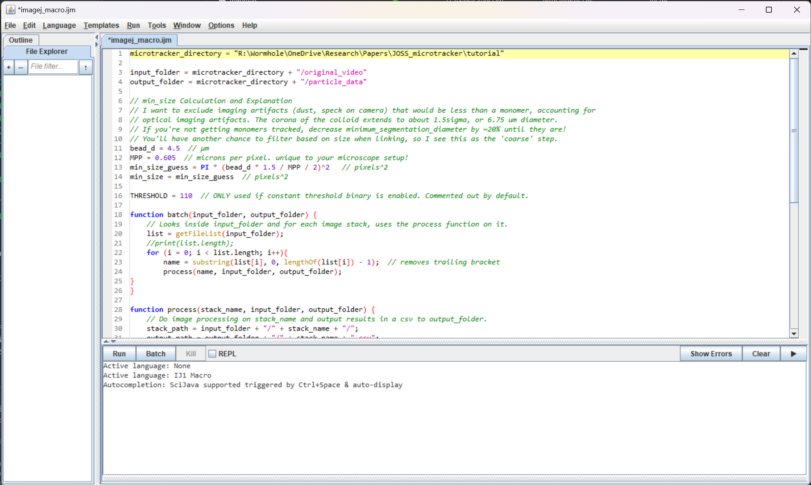

# Segmentation
On this page, you will learn what image segmentation is and how to perform it on your video using ImageJ. This step is not needed if you have already segmented your video using another tool.

## Intro
[Image segmentation](https://en.wikipedia.org/wiki/Image_segmentation) is the process of separating the image background (stuff we don't care about) from the foreground (stuff we care about). Here, our foreground is the microbots.

Segmentation can be performed with a variety of methods, from simple (thresholding), to advanced (training neural nets). MicroTracker does not segment videos, due to the variety of softwares and methods available that are specific to the microscopy techniques used. In this guide, we will use [ImageJ/Fiji](https://imagej.net/software/fiji/) due to its simplicity, flexibility, and established use. However, you may use other software such as [illastik](https://www.ilastik.org/) if more advanced segmentation is needed, but a walkthrough of that is out of scope of this guide.

!!! info
    Segmentation will process raw microscopy video into a `.csv` file that contains a row for each **observation** of a particle on each individual frame. This data *does not* contain any information about the video, like that the particles are moving/rotating between frames. That's where MicroTracker comes in.

## Setup
#### Download Fiji
If you've conducted microscopy research, you've likely heard of ImageJ. Fiji is a distribution of ImageJ with useful plugins already installed. Download it at their website [here](https://fiji.sc/).

#### Use MicroTracker to create an ImageJ macro for your videos
First, make sure you've opened a terminal in the same folder from the step: [Creating an environment for your project](@ref). To test this, use the `pwd()` command from Julia base and verify you're in the correct directory. Also, activate the julia environment with the line `] activate . `

```julia-repl
julia> pwd()
"R:\\Wormhole\\OneDrive\\Research\\Papers\\JOSS_microtracker\\tutorial"

(v1.9)> activate .
Activating project at `R:\Wormhole\OneDrive\Research\Papers\JOSS_microtracker\tutorial`

julia> using MicroTracker
```

We'll be using the [`create_imagej_macro_here`](@ref) function to create an imagej macro to start with.

```julia-repl
julia> create_imagej_macro_here(MPP=0.605, minimum_segmentation_diameter=4.5)
[ Info: ImageJ macro created at ~/tutorial/imagej_macro.ijm. See MicroTracker segmentation docs for instructions on how to use it
```

## Using the macro
Now, open Fiji. Navigate to `Plugins -> Macros -> Edit` and browse to the newly created `imagej_macro.ijm`.

You should now see an open window with the generate `.ijm` script for your project.


You'll notice a few things:
1. The `microtracker_directory` variable was set to the working directory where you ran the [`create_imagej_macro_here`](@ref) function, i.e. your project folder.
2. This macro takes your videos in `/original_video` as input, and outputs the segmented `.csv` files in `/particle_data`.
3. The minimum segmentation area is calculated according to what you supplied as the `minimum_segmentation_diameter`.

Click "Run" to run the macro. This opens up each video, applies a binary filter, and runs the ImageJ "Analyze Particles" function. See [their docs](https://imagej.nih.gov/ij/docs/menus/analyze.html) for more information. After doing this, it saves a `.csv` file of the results with an *identical filename to your video*.

!!! tip
    This macro is just a starter example! Though it works for the vast majority of microbot microscopy video with good contrast, additional filters like gaussian blur, denoise, or background removal may be needed. To see what commands need to be added in the macro, use the Fiji "Record" function at `Plugins -> Macros -> Record` while you apply the filter in the GUI.

After this process, you should have a `.csv` file in `particle_data` for each video in `original_video`. You can open one up in excel and verify it contains the `X`, `Y`, and `Label` columns.

## Caveats
- On Mac, when running the ImageJ macro more than once, it will error with "Permission denied", as it will not overwrite previously saved `.csv` files with the same name. To fix this, just remove the generated `.csv` files in `particle_data` before re-running the macro.