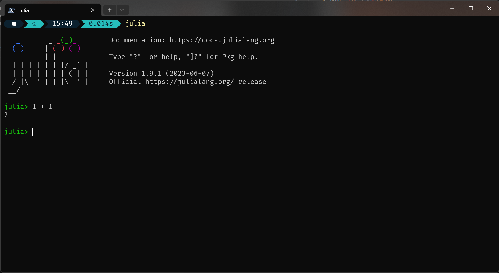

# Setting Up
On this page, you will
1. Download and install Julia.
2. Create a project folder with a matching Julia environment.
3. Add MicroTracker and other necessary packages to your environment.
4. Create an organized folder structure for your project using MicroTracker.

## Download and install Julia
Download and install Julia from their website [https://julialang.org/downloads](https://julialang.org/downloads). For full instructions for every operating system, see [https://julialang.org/downloads/platform/](https://julialang.org/downloads/platform/). Be sure to add Julia to PATH, as this allows you to call Julia anywhere from the command line by typing `julia`. On Windows, this is by just checking the box, but on Mac, you'll have to run the commands in your terminal from the second Julia website link above.

!!! tip
    On Windows, I recommend installing Julia from the [Windows Store](https://apps.microsoft.com/store/detail/julia/9NJNWW8PVKMN?hl=en-us&gl=us). This automatically adds Julia to your PATH and also installs the `juliaup` command line tool to seamlessly update Julia when new versions are released. Both options work though!

### Test if it works
Open a terminal window and type `julia`. You should be able to run simple commands, like `1+1`. For more basic information on Julia, see their great [documentation](https://docs.julialang.org/en/v1/manual/getting-started/).



## Open a Julia REPL in a directory
Its easiest to use MicroTracker if you know how to open a terminal at a specific directory. On Windows, I use [the new Windows Terminal](https://apps.microsoft.com/store/detail/windows-terminal/9N0DX20HK701?hl=en-us&gl=us&rtc=1) which allows you to right click in a folder and click "Open in Terminal". You can also type in the explorer address bar `cmd` to [get the same effect](https://www.youtube.com/watch?v=JLqIkPfU_0U). On Mac, right click on the *folder* and click `New Terminal at Folder`. Once the terminal is open, you should be able to type `julia` to enter the Julia REPL.

If for some reason you can't/don't want to add Julia to your PATH, you can use the Base Julia function `cd` to navigate to your folder. Verify your directory with the `pwd` function.

## Creating an environment for your project
Now we need a place for our MicroTracker project to live. This will contain all the microscopy video, data we will generate, and tools we will use to analyze our data.

To do this, just create a new empty folder. Name it descriptively, like `2023-06-21 microwheel field sweep`. For this page, I'll just create a folder named `tutorial`. Open a Julia REPL in this directory as described in the above section.

Now, type `]` at the empty `julia>` prompt, before typing anything else. This enters you into [package mode](https://docs.julialang.org/en/v1/stdlib/Pkg/). You'll notice that now instead of `julia>`, you see the name of the current environment in blue. Now, use the following commands to create a new environment in your current folder:

```julia-repl
(@v1.9) pkg> activate .
Activating new project at `R:\Wormhole\OneDrive\Research\Papers\JOSS_microtracker\tutorial`

(tutorial) pkg> add MicroTracker Pluto PlutoUI
...output snipped
```

and wait as the packages and all of their dependencies download! This adds MicroTracker, Pluto, and PlutoUI packages to your environment. If you do not plan on using the included Pluto notebook, then only MicroTracker is needed.

!!! tip 
    When adding MicroTracker, Julia will also automatically precompile the environment to make future use of the package speedy. This may take awhile, as this environment contains everything needed to process and visualize your data. It also comes included with sample microscopy video, so it may take a little longer to download than other packages.

## Create a MicroTracker project
Now that we have a new Julia environment in this folder with MicroTracker installed, lets start using MicroTracker! To import a package, Julia uses the keyword `using`. Make sure you're out of package mode by pressing `backspace`. The prompt should read `julia>` again. After that, we'll use the [`create_project_here`](@ref) function.

```julia-repl
julia> using MicroTracker

julia> create_project_here()
[ Info: New MicroTracker project created in R:\Wormhole\OneDrive\Research\Papers\JOSS_microtracker\tutorial

```

You should now see the layout of a MicroTracker project in your folder. Once you get the hang of MicroTracker, the argument `include_examples=false` can be used to exclude the sample video and data for future projects.

```
tutorial/
├── original_video/
│   ├── 5_8p4_28p68/
│   └── 5_13p5_61p35/
├── particle_data/
│   ├── 5_8p4_28p68
│   └── 5_13p5_61p35
├── linked_data/
│   └── (B_mT=(2, Float64), FPS=(3, Float64), f_Hz=(1, Int64)) - (MPP = 0.605, SEARCH_RANGE_MICRONS = 1000, MEMORY = 0,   
│        STUBS_SECONDS = 0.5).csv
└── microtracker_notebook.jl
```

- `original_video` The raw microscopy video goes here, in the Image Sequence format (folders of `.tif` images). Many microscopes output automatically in this format, or [Fiji](https://imagej.net/software/fiji/) can be used to save almost any format into the Image Sequence format.
- `particle_data` This is where a `.csv` file for each video, with the same filename, will be located. These csv files are the result of segmentation, which is explained thoroughly in the next page of the manual!
- `linked_data` This is the primary output of MicroTracker. This is where `.csv` files are output that contains data for *every* microbot across *all* videos. This ensures that all analysis is carried out with the same parameters.
- `microtracker_notebook.jl` A [Pluto](https://github.com/fonsp/Pluto.jl) notebook containing a sample workflow and plots. An easy alternative to typing in the command prompt.

## Subsequent sessions
After closing out Julia or restarting your computer, you'll have to re-open a Julia REPL in the same folder as explained in the [Open a Julia REPL in a directory](@ref) section. Don't forget to re-activate the environment you created and installed MicroTracker into. Remember, use `]` to get into [Pkg mode](https://docs.julialang.org/en/v1/stdlib/Pkg/) to run the `activate .` command.

```julia-repl
julia> pwd()
"R:\\Wormhole\\OneDrive\\Research\\Papers\\JOSS_microtracker\\tutorial"

(v1.9)> activate .
Activating project at `R:\Wormhole\OneDrive\Research\Papers\JOSS_microtracker\tutorial`

julia> using MicroTracker
```

### Alternatives
1. If you open the Pluto notebook as described on the [Pluto](@ref) page, you do not need to activate the environment.
2. VSCode.
